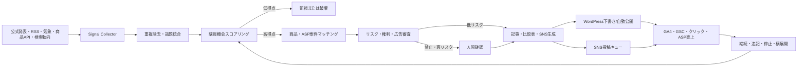

# AIトレンドコマースBOT事業設計書

更新日: 2026-06-24

## 0. この事業を一言でいうと

**世の中の流行・ニュース・季節変化をAIが常時監視し、「今すぐ商品が売れそうな話題」だけを見つけ、記事・比較表・SNS投稿・アフィリエイト導線を自動生成して、反応のあるテーマへ追加投資する事業**である。

専門家ブログや体験ブログが中心ではない。ニュースサイトでもない。ニュースをそのまま転載するのでもない。

> 話題を見つける → 消費者への影響を整理する → 必要になる商品を探す → 買い方を提示する

これをBOTとして繰り返す「トレンド検知型コマースメディア」である。

### 具体例

```text
気象庁が猛暑予報を発表
        ↓
AIが「暑さ対策商品の需要増」と判定
        ↓
冷却ベスト・携帯扇風機・日傘・宅配水を商品DBから抽出
        ↓
既存の「暑さ対策グッズ比較」を最新化
        ↓
「誰に何が必要か」を解説する速報記事とSNS投稿を作成
        ↓
楽天・Amazon・ASPへの商品導線を設置
        ↓
6時間、24時間、72時間のクリック・売上で継続判定
```

別の例:

```text
人気AIツールが新機能を発表
        ↓
対象ユーザーと代替ツールを特定
        ↓
「新機能でできること」「有料版が必要な人」「競合比較」を生成
        ↓
AI SaaS・スクール・関連機器の案件へ接続
```

## 1. 経営判断

### 採用する方針

- 事業全体はジャンル横断でよい。
- 初期は1ドメイン内に3つの明確なカテゴリを持つ。
- AIが監視、採点、構成、下書き、商品候補、SNS展開、分析を行う。
- 人間は情報源登録、禁止テーマ設定、例外承認、週次レビューを行う。
- 低リスク案件は、検証期間後に自動公開まで進める。
- 高リスク分野は常に人間承認を必須にする。

### 採用しない方針

- ニュース本文の転載・言い換え量産
- トレンドと関係のない商品の強引な紹介
- 芸能人の事件・災害被害・死亡事故への便乗販売
- 使用していない商品の「使ってみた」レビュー
- 医療、投資、法律を完全自動公開
- 最初から多数のドメインを作ること
- 売上データなしで100記事を固定的に作ること

Googleは、生成方法を問わず、検索順位操作を目的とする独自価値のない大量生成をスパムとして扱う。BOTの価値は記事数ではなく、情報の速さ、商品比較、価格・在庫・条件の確認、消費者の判断支援に置く。[Google Search spam policies](https://developers.google.com/search/docs/essentials/spam-policies)

## 2. 初期メディア設計

### 仮サイト名

**選び方メモ（仮）**

タグライン:

> 話題のニュースを、いま何を選ぶべきかに変える。

ドメイン・商標・SNS IDは未確認。契約前に調査する。

### 初期カテゴリ

1. **季節・暮らし**
   - 天候、防災、新生活、旅行、食品、家事、節約用品
2. **美容・フィットネス**
   - メンズ美容、筋トレ用品、プロテイン、身だしなみ
3. **AI・ガジェット**
   - AIサービス、スマホ、PC周辺機器、アプリ、サブスク

健康は「健康器具・一般的な生活用品」まで。病気の診断・治療・サプリメントの効能断定は初期対象外。投資は金融商品紹介の正確性・規制・審査負荷が高いため、BOT自動公開の対象外とする。

### なぜ最初は1ドメインか

- 初期予算1万円で複数ドメインを管理すると、データと運用が分散する。
- BOTの判定精度を1か所で学習させられる。
- 3カテゴリのどこが売れるか比較できる。
- 勝ちカテゴリが明確になったら独立サイトへ分離できる。

カテゴリ独立条件は、次のいずれか。

- カテゴリ単体で月3万円を3か月連続
- 月間30本以上の有望トレンドを検知
- 指名検索、SNS読者、案件構成が他カテゴリと明確に分離

## 3. 事業システム全体像



### BOTの構成

1. **収集BOT**: 情報源を定期巡回して話題候補を保存
2. **統合BOT**: 同じ出来事の記事を1つのイベントへ統合
3. **商機判定BOT**: 商品が売れる理由と期限を採点
4. **商品選定BOT**: 楽天・Amazon・ASPから候補を抽出
5. **編集BOT**: 速報、比較、SNS文章を構造化生成
6. **品質BOT**: 出典、誇大表現、広告表示、重複を確認
7. **配信BOT**: WordPressとSNS投稿キューへ送る
8. **分析BOT**: クリック・売上を集計し、停止または増産を判断

実装上は、最初から8個の独立AIを作る必要はない。1つのPythonアプリ内に8つのジョブとして実装し、各処理の入力・出力をDBへ保存する。

## 4. 情報源

### 優先順位

1. 官公庁・自治体・気象機関の公式発表/RSS/XML
2. メーカー・サービスの公式ニュースリリース/RSS/API
3. PR配信サイトの許可されたRSS・API
4. EC商品API
5. Google Trends公式データ
6. 自サイトのSearch Console検索クエリ
7. SNS APIで取得可能な公開情報
8. 人間が投入するURL・テーマ

### 初期の実装対象

- 登録済みRSS/Atomフィード
- 気象・防災等の公式公開フィード
- 楽天商品検索・製品検索API
- ASP案件のCSVまたは手動台帳
- WordPress、GA4、Search Console
- 人間によるトレンドURL投入

Google Trends APIは2026年6月時点でも限定アルファで、一般利用を前提にできない。アクセスできる場合だけ追加し、MVPの必須依存にしない。[Google Trends API alpha](https://developers.google.com/search/apis/trends)

楽天の商品価格ナビ製品検索APIはキーワード・ジャンルによる製品検索に対応する。短時間に同じリクエストを大量送信しないようキャッシュとレート制御を設ける。[楽天ウェブサービス](https://webservice.rakuten.co.jp/documentation/ichiba-product-search)

Amazonは旧PA-APIの新規受付を終了し、Creators APIへの移行を案内している。初期売上がない段階ではAPI利用条件を満たせない可能性があるため、MVPは手動登録したAmazon商品リンクでも動く設計にする。[Amazon公式案内](https://webservices.amazon.co.jp/paapi5/documentation/register-for-pa-api.html)

### 収集しないもの

- ログインが必要なページ
- 有料記事・ニュース本文
- robots.txtや利用規約で禁止されたページ
- 個人の非公開投稿
- SNS画面の無断スクレイピング
- ASP管理画面の自動スクレイピング

ニュース本文を保存せず、タイトル、URL、公開者、公開日時、短い抜粋、ハッシュ、BOTが作った事実メモを保存する。記事本文は元ニュースの代替にならない量に限定する。

## 5. トレンド検知と採点

### イベントデータ

```text
event_id
title
canonical_topic
entities[]
source_urls[]
first_seen_at
last_seen_at
source_count
velocity
region
event_type
expected_expiry_at
risk_flags[]
```

### 100点スコア

| 項目 | 配点 | 判定内容 |
|---|---:|---|
| 購買意図 | 25 | 読者が商品・サービスを必要とするか |
| 商品適合 | 20 | 紹介可能な商品・案件が3件以上あるか |
| 話題速度 | 15 | 複数ソース、検索・SNS増加があるか |
| 収益期待 | 15 | 単価、CVR、承認率、在庫を考慮 |
| 公開速度 | 10 | 競合より早く正確に出せるか |
| 継続性 | 5 | 速報後に比較記事として残るか |
| 競合余地 | 5 | 大手が十分に答えていないか |
| 安全性 | 5 | 法務・倫理・ブランドリスクが低いか |

### 判定

- 80〜100: 即時制作
- 65〜79: 人間確認または追加ソース待ち
- 50〜64: 監視
- 0〜49: 破棄
- 禁止フラグ: 点数に関係なく停止

### 期待収益

```text
expected_revenue
= estimated_visits
× outbound_click_rate
× advertiser_conversion_rate
× approval_rate
× reward
```

初期値は仮説として設定し、実績が50クリック、5発生など一定量に達するごとにカテゴリ・案件別の値へ更新する。スコアはAIの雰囲気ではなく、数値とルールの組み合わせで決める。

## 6. 商品・案件マッチング

### 案件DB

```text
offer_id
network
advertiser
name
category
keywords[]
problem_tags[]
event_tags[]
affiliate_url
landing_url
reward_type
reward_value
approval_conditions
allowed_media[]
prohibited_terms[]
stock_status
price
price_checked_at
starts_at
ends_at
status
last_verified_at
```

### マッチング方法

1. ニュースから人物・商品・悩み・季節・場所を抽出
2. `problem_tags` と `event_tags` で案件を検索
3. 商品在庫、価格、リンク期限、SNS掲載可否を確認
4. 用途、価格帯、対象者が異なる3〜5商品を選ぶ
5. 報酬だけでなく読者適合を採点
6. 根拠のある比較軸を生成

AIは生のアフィリエイトURLを作らない。記事には論理IDを挿入し、公開時にDBから有効リンクを解決する。

```text
[offer id="cooling_vest_01" placement="top_pick"]
```

案件終了・在庫切れ・価格確認期限切れの場合は、自動で代替商品、検索リンク、非アフィリエイトリンクのいずれかへ切り替える。

## 7. 作るコンテンツ

### 4種類

#### A. 速報商機記事

- 何が起きたか
- 誰に影響するか
- いつまでに対応が必要か
- 必要になり得る商品カテゴリ
- 最新情報の確認先

#### B. エバーグリーン比較記事

- 用途別の選び方
- 比較表
- 向く人・向かない人
- 価格・在庫確認日
- 関連する最新ニュースへのリンク

#### C. 既存記事の更新

新記事より優先する。既存の比較ページへニュース、価格、在庫、新商品を追記し、更新履歴を残す。

#### D. SNS投稿

- X: 速報、数字、比較、記事誘導
- Threads: 生活への影響、共感、会話
- Instagram: 保存用カルーセル
- TikTok: 初期対象外。動画運用を開始した時点で追加

### 記事生成ルール

- 必ず2つ以上の独立ソース、または1つの公式一次情報を使う。
- 事実、推測、広告訴求を明確に分ける。
- 「使った」「効果があった」等の未経験表現は禁止。
- 公開日時、情報確認日時、価格確認日時を表示する。
- 元記事を読まなくてもニュース全文が分かる転載記事にしない。
- 商品を買わない選択肢も記載する。
- 災害時の不安を過度に煽らない。

記事は、行動心理学と選択アーキテクチャを利用して「読者が迷わず、自分に合う商品を選べる」構造にする。ただし、偽の希少性、恐怖の誇張、架空レビュー等のダークパターンは使用しない。詳細は「21. 行動心理学を使った記事設計」に定義する。

## 8. 100個の「売れるトリガー型」

固定タイトルではなく、BOTが検索・ニュース・商品を差し替えるテンプレートとして管理する。

### 季節・天候（1〜15）

1. 猛暑予報 → 冷却用品・日傘・飲料
2. 熱帯夜増加 → 寝具・冷感用品・サーキュレーター
3. 梅雨入り → 除湿機・部屋干し用品
4. 台風接近 → 防災用品・モバイル電源
5. 大雪予報 → 防寒・雪かき・滑り止め用品
6. 寒波 → 暖房器具・断熱用品
7. 花粉飛散開始 → 空気清浄機・メガネ・衣類ケア
8. 黄砂予報 → 空気清浄・洗濯用品
9. 紫外線増加 → 日焼け止め・帽子・日傘
10. 湿度上昇 → カビ対策・除湿用品
11. 乾燥注意 → 加湿器・保湿用品
12. 防災週間 → 保存食・ラジオ・防災セット
13. 台風シーズン前 → 窓・停電対策
14. 冬物需要開始 → 暖房・寝具の早期比較
15. 春の気温上昇 → 衣替え・収納用品

### 行事・生活周期（16〜30）

16. 新生活 → 家電・家具・通信
17. 引越し増加 → 梱包・清掃・回線
18. 入学・入社 → PC・バッグ・身だしなみ
19. ゴールデンウィーク → 旅行用品・レンタカー
20. 夏休み → レジャー・旅行・暑さ対策
21. 帰省 → 手土産・交通・モバイル用品
22. 敬老の日 → 健康家電・ギフト
23. ハロウィン → 食品・装飾・衣装
24. ブラックフライデー → セール対象商品の比較
25. クリスマス → ギフト・玩具・食品
26. 年末大掃除 → 掃除家電・洗剤
27. 正月 → 食品・福袋・帰省用品
28. バレンタイン → 食品・美容・ギフト
29. 母の日・父の日 → 用途別ギフト
30. ボーナス時期 → 高額家電・PC・自己投資

### 商品発売・改定（31〜45）

31. 新型スマホ発表 → 旧型比較・ケース・充電器
32. 新型PC発表 → 用途別比較・周辺機器
33. 新型イヤホン発表 → 旧型・競合比較
34. ゲーム機・ゲーム発売 → 周辺機器・予約情報
35. 家電新モデル → 型落ちとの価格差
36. コスメ新商品 → 成分・用途・旧商品比較
37. プロテイン新味 → 価格・栄養・容量比較
38. AIモデル発表 → 対応サービス・PC・学習教材
39. アプリ新機能 → 有料版・代替アプリ比較
40. サブスク料金改定 → 継続・乗換え比較
41. 商品値上げ発表 → 買い時・代替品
42. 商品値下げ発表 → 競合・旧価格比較
43. 生産終了 → 後継機・消耗品・代替品
44. リニューアル → 変更点と旧商品比較
45. 対応規格変更 → 変換器・買替え・互換性

### 品薄・価格・在庫（46〜55）

46. 品薄報道 → 在庫確認・代替品
47. 原材料高騰 → 値上げ前候補・代替品
48. 再入荷 → 購入条件・競合比較
49. 予約開始 → 店舗・特典比較
50. セール開始 → 通常価格・実質割引比較
51. ポイント増量 → 購入先比較
52. クーポン配布 → 適用条件・対象商品
53. 容量変更 → 単価比較
54. 定期便改定 → 単品購入との比較
55. 送料無料条件変更 → 合計費用比較

### SNS・口コミ流行（56〜65）

56. バズ調理器具 → 用途・代替品・注意点
57. バズ食品 → 容量・価格・購入先
58. バズコスメ → 成分・色・対象者
59. バズ筋トレ用品 → 安全な使い方・代替品
60. バズ収納用品 → サイズ・設置条件
61. バズ掃除方法 → 必要用品・使えない素材
62. バズレシピ → 調理器具・食材
63. バズAI活用法 → 対応ツール・料金比較
64. バズ通勤用品 → 使用場面・耐久性比較
65. 売切れ商品 → 同等機能の代替商品

### 制度・生活変化（66〜75）

66. 電気料金変化 → 節電家電・計測器
67. 郵便・配送変更 → 梱包・受取用品
68. 通信プラン変更 → 料金・端末比較
69. キャッシュレス変更 → 対応機器・家計管理
70. リモートワーク動向 → デスク・周辺機器
71. 防災情報更新 → 備蓄内容の見直し
72. 交通ルール変更 → 自転車・安全用品
73. ゴミ分別変更 → ゴミ箱・処理用品
74. 旅行制度変更 → 保険・通信・予約サービス
75. 学習制度変更 → 教材・オンライン講座

### 悩み急増（76〜85）

76. 睡眠関連検索増 → 寝具・遮光・環境家電
77. 電気代関連検索増 → 省エネ用品
78. 花粉関連検索増 → 花粉対策用品
79. 防災関連検索増 → 備蓄・電源
80. 筋トレ開始増 → 初心者器具・プロテイン
81. ダイエット開始増 → 記録用品・運動器具
82. メンズ美容検索増 → 初心者セット
83. 自炊検索増 → 調理器具・宅食
84. AI副業検索増 → ツール・講座
85. パスワード被害増 → セキュリティ製品

### 比較・乗換え（86〜95）

86. A対Bが急増 → 直接比較記事
87. 新型対旧型 → 差額と買うべき人
88. 有料対無料 → 制限・損益分岐
89. 購入対レンタル → 利用期間別比較
90. 店舗対EC → 価格・保証・受取比較
91. 単品対定期便 → 総額比較
92. 国内対海外製品 → 保証・規格比較
93. 高価格対低価格 → 必要機能比較
94. 新品対中古 → 保証・劣化リスク
95. 専用品対代用品 → 安全性・費用比較

### 速報後の資産化（96〜100）

96. 速報 → よくある質問ページ
97. 速報 → 用途別ランキング
98. 速報 → 価格・在庫追跡ページ
99. 速報 → 初心者向け完全ガイド
100. 複数速報 → 年間買い時カレンダー

## 9. 自動化レベル

### Level 0: 監視のみ

BOTがトレンドを集め、ランキングを表示。公開しない。

### Level 1: 下書きBOT

高得点イベントの記事、商品候補、SNS投稿を作り、人間が公開する。

### Level 2: 低リスク自動公開

次の条件をすべて満たす案件だけ自動公開する。

- ホワイトリスト情報源
- 季節商品、一般家電、ガジェット等の低リスクカテゴリ
- 公式一次情報あり
- 有効な商品リンク3件以上
- 禁止表現ゼロ
- 同種テンプレートで直近20件の人間承認率95%以上
- 修正率10%未満

### Level 3: 自動改善

BOTがタイトル、比較表、商品候補、内部リンクを提案・A/Bテストする。売上に直結する順位変更や記事削除は人間承認を残す。

### 推奨移行

- 1〜30日: Level 0〜1
- 31〜90日: Level 1
- 91日以降: 条件を満たしたカテゴリのみLevel 2
- 売上・品質が安定後: Level 3

「基本AIに任せる」は、最終的には週1回30〜60分の例外確認で回る状態を意味する。ただし最初の90日はBOTの教師データを作る期間であり、完全放置はしない。

## 10. 日次BOT処理

### 15分〜1時間ごと

1. 登録ソースを取得
2. 新着判定
3. 本文ハッシュと意味類似度で重複除去
4. イベント統合
5. 商品・購買意図抽出
6. リスク判定
7. 商機スコア計算

### 高得点イベント発生時

1. 商品DB照合
2. 既存記事の有無を検索
3. 既存記事更新か新規作成か決定
4. 構成・本文・比較表・メタ情報生成
5. 根拠URLと主張を照合
6. アフィリエイト論理ID挿入
7. WordPressへ送信
8. SNS投稿キュー作成

### 公開後

- 6時間: SNS反応、リンククリック
- 24時間: 記事流入、商品クリック
- 72時間: 発生、売上、関連検索
- 7日: 追記・統合・停止
- 30日: 資産記事化またはアーカイブ

## 11. 投稿判断と寿命管理

### 継続

- クリック率がカテゴリ中央値以上
- SNS保存・返信が上位25%
- 発生または商品詳細クリックあり

### 追加展開

- 用途別比較を追加
- 価格帯別ページを追加
- Instagramカルーセル化
- 関連商品・代替品記事を追加

### 停止

- 72時間で流入・クリックがほぼゼロ
- 情報が訂正された
- 在庫・案件が消滅した
- トレンドと商品需要の因果が弱い

### アーカイブ

- 検索需要が終了し、再発可能性が低い
- 最新状態へ安全に更新できない
- 類似記事へ統合できる

削除は即時に行わず、リダイレクト、統合、noindexの適否を判断する。

## 12. SNS設計

顔出し・声出し・動画制作を前提にしない。

### X

- 速報と相性が最もよい
- 1日最大3件まで。話題がない日は投稿しない
- 1投稿目でニュース、2投稿目で生活への影響、3投稿目で比較記事
- 完全自動返信や大量メンションは禁止

X APIは従量課金で、2026年6月時点の公式料金ではURL付き投稿作成は1リクエスト$0.20。初期は投稿文生成と手動投稿、または費用上限付きAPI運用にする。[X API pricing](https://docs.x.com/x-api/getting-started/pricing)

### Threads

- ニュースの生活影響や意見を短文で投稿
- Xと同一文面にしない
- API導入前は投稿キューから手動

### Instagram

- 速報そのものより「保存できる比較」へ変換
- 7〜10枚のカルーセルを自動生成
- 価格・在庫が変わりやすい情報は画像内へ固定せず、本文・記事へ誘導

### TikTok

初期対象外。将来、文字アニメーションと商品画像の権利処理を確立したら追加する。

## 13. WordPressとリンク自動化

### 状態遷移

```text
detected
→ scored
→ matched
→ drafting
→ fact_checked
→ compliance_checked
→ approval_required / auto_publishable
→ wp_draft / published
→ measuring
→ scaling / monitoring / archived
```

WordPress REST APIの `POST /wp/v2/posts` で下書きまたは公開記事を作成する。初期はApplication Passwordを使い、投稿専用ユーザーへ最小権限を付与する。[WordPress REST Posts API](https://developer.wordpress.org/rest-api/reference/posts/)

自動公開後も、次の場合は即時に下書きへ戻す。

- 公式情報の訂正を検知
- 出典URLが消失
- 商品リンク切れが全候補の50%超
- 禁止表現を後から検知
- 人間が緊急停止フラグを設定

## 14. 計測と学習

### KPI

```text
売上
= 検知イベント数
× 制作採用率
× 公開成功率
× 記事流入
× 商品クリック率
× 購入・申込率
× 承認率
× 報酬
```

### イベント別に保存

- 検知時刻
- 公開時刻
- 検知から公開までの分数
- スコアと内訳
- 使用ソース
- 紐づけ商品
- SNS表示・保存・クリック
- 記事セッション
- 商品クリック
- 発生・承認・売上
- API・生成コスト
- 人間の修正量

### BOTの学習対象

- どの情報源が売上へつながるか
- どのトリガーがクリックされるか
- どの商品カテゴリが承認されやすいか
- 何点以上なら黒字化するか
- 新規記事と既存記事更新のどちらが強いか
- 公開速度が売上へどの程度影響するか

AIへ「改善して」と丸投げせず、実績からスコア重みを更新する。生成モデルの再学習ではなく、ルール、閾値、商品タグ、プロンプト、カテゴリCVRを改善する。

## 15. 技術要件

### MVP

- Python 3.12+
- SQLite
- SQLAlchemy / Alembic
- Pydantic
- OpenAI Responses API + Structured Outputs
- feedparser / HTTPクライアント
- APSchedulerまたはcron
- WordPress REST API
- 楽天API
- GA4 Data API / Search Console API
- ASP CSV取込
- 管理画面なし。CLIと週次HTMLレポート

Structured Outputsでイベント、記事、商品候補、SNS投稿をJSON Schemaへ固定する。ただしスキーマ準拠は事実の正しさを保証しないため、出典照合は別処理にする。[OpenAI Structured Outputs](https://developers.openai.com/api/docs/guides/structured-outputs)

即時性が不要なSNS派生、メタ説明、過去記事の分類はBatch APIへ回せる。公式仕様では同期処理より50%低コストで、24時間以内の処理枠である。[OpenAI Batch API](https://developers.openai.com/api/docs/guides/batch)

### ディレクトリ案

```text
trend_commerce/
  collectors/       # RSS、公式フィード、商品API
  normalization/    # URL・日時・本文ハッシュ
  clustering/       # 同一イベント統合
  scoring/          # 商機・リスク採点
  catalog/          # 商品・ASP案件
  matching/         # イベントと商品対応
  generation/       # 記事・比較表・SNS
  verification/     # 出典・主張・権利確認
  compliance/       # PR表示・禁止テーマ
  publishing/       # WordPress・SNSキュー
  analytics/        # GA4・GSC・ASP
  optimization/     # 継続・停止・横展開
  prompts/          # コード管理プロンプト
  cli/              # 承認・停止・再実行
```

### 主要テーブル

- `sources`
- `raw_signals`
- `trend_events`
- `event_sources`
- `event_scores`
- `products`
- `offers`
- `event_offer_matches`
- `content_items`
- `content_claims`
- `evidence_items`
- `social_posts`
- `publication_events`
- `metrics_hourly`
- `conversions`
- `costs`
- `bot_runs`
- `human_reviews`
- `block_rules`

### 冪等性

- URL正規化ハッシュ
- 本文・タイトルハッシュ
- 意味類似度
- `event_id + content_type + platform + angle` の一意制約
- WordPress投稿IDの保存
- ASP CSVの取引ID一意制約

### セキュリティ

- APIキーをGit・DBへ保存しない
- ログへアフィリエイト認証情報を出さない
- WordPress投稿専用アカウント
- 外部HTMLをプロンプト命令として信用しない
- 取得本文とシステム命令を分離
- 1日の生成・投稿・API費用に上限を設定
- 緊急停止コマンドを用意

## 16. リスク管理

### 常時自動公開禁止

- 医療・治療・健康効果
- 投資・金融商品
- 法律・給付金の断定
- 災害発生中の煽り販売
- 事故・事件・死亡
- 未成年者を主対象とする商品
- リコール対象商品の推奨
- 芸能人の私生活・炎上
- 根拠のない品薄・値上げ情報

### 広告表示

サイト、記事、SNSの見やすい位置に広告であることを表示する。消費者庁は、サイト冒頭に一文を置くだけでなく、表示全体として一般消費者に明瞭かを重視している。[消費者庁ステルスマーケティングQ&A](https://www.caa.go.jp/policies/policy/representation/fair_labeling/faq/stealth_marketing/)

### 品質基準

- 出典不明の事実を公開しない
- AIの推測をニュース事実として書かない
- 価格は確認日時を表示
- 在庫ありを保証しない
- ランキング根拠を表示
- 報酬が高いだけで1位にしない
- 訂正履歴を残す

## 17. 費用設計

初期予算1万円の目安:

| 項目 | 目安 |
|---|---:|
| ドメイン | 1,000〜3,000円/年 |
| サーバー | 500〜1,500円/月 |
| WordPressテーマ | 0円 |
| OpenAI API | 初月1,000〜3,000円上限 |
| X API | 初期は0円・手動投稿 |
| 商品API | 無料枠・利用条件内 |
| 予備費 | 残額 |

OpenAI API費用はジョブごとに記録する。1記事の期待収益が生成費を下回るテーマは自動制作しない。初月は精度検証のため、1日あたりの生成上限を設定する。

## 18. 90日ロードマップ

### 1〜14日: BOTの設計と手動検証

- 3カテゴリと禁止テーマ決定
- 情報源30件をホワイトリスト登録
- 商品・ASP案件を100件登録
- 過去のニュース50件を人間が採点
- 100トリガー型をDB化
- サイトとSNSアカウントを準備

### 15〜30日: Shadow Mode

- 収集・統合・採点BOTを稼働
- BOTは下書きだけ生成
- 1日最大3候補を人間が採否判定
- 10〜20記事公開
- 人間の採点差・修正量を記録

### 31〜60日: 半自動運用

- 低リスクカテゴリはWordPress下書きまで自動
- SNS文面・カルーセル構成を自動生成
- 公開後6/24/72時間計測
- 売れない情報源とトリガーを停止
- 既存比較記事の更新を優先

### 61〜90日: 限定自動公開

- 承認率95%以上のテンプレートだけ自動公開候補
- 1日最大1記事で開始
- 緊急停止と自動下書き戻しを有効化
- 黒字カテゴリへ商品・情報源を追加
- 月1万円達成可否を実データで判断

## 19. 初月1万円の評価

新規サイトのSEOだけで初月1万円はかなり難しい。トレンドとSNSを利用するため可能性は上がるが、保証できない。

初月の現実的な成功条件:

- 100件以上のトレンドを検知
- 20〜30件を制作候補として採点
- 10〜20記事を公開
- 30〜60件のSNS投稿
- 商品リンククリック100件
- 最初の発生を確認
- 売れるトリガーを1つ特定

1万円へ最短で近づけるには、転職などの高単価案件よりも、話題との接続が自然で即時購入される楽天・Amazon物販、季節商品、セール、ガジェット、AI SaaSを優先する。ただし物販は単価が低いため、大量アクセスか高額商品が必要になる。

## 20. AI会社組織と担当分担

### 経営体制

会社の代表取締役CEOはユーザー本人とする。AIは会社役員や従業員を模した担当BOTとして動くが、法的責任、契約、支払い、最終的な経営判断はCEOに帰属する。

```text
代表取締役CEO（あなた）
│
├─ AI経営執行室（COO BOT）
│  ├─ 日次ジョブ統括
│  ├─ 各部署への案件振り分け
│  └─ 例外・障害のCEO報告
│
├─ トレンド情報部
│  ├─ 情報収集担当
│  ├─ イベント統合担当
│  └─ 商機採点担当
│
├─ 商品・収益部
│  ├─ 商品検索担当
│  ├─ ASP案件管理担当
│  └─ 収益性評価担当
│
├─ 編集・行動設計部
│  ├─ 記事企画担当
│  ├─ 行動心理コピー担当
│  ├─ 比較表・CTA担当
│  └─ SNS展開担当
│
├─ 品質・コンプライアンス部
│  ├─ ファクトチェック担当
│  ├─ 広告・法務チェック担当
│  ├─ 権利・引用チェック担当
│  └─ ダークパターン監査担当
│
├─ 配信運用部
│  ├─ WordPress担当
│  ├─ SNS投稿キュー担当
│  ├─ リンク・在庫監視担当
│  └─ 緊急停止担当
│
├─ データ分析部
│  ├─ GA4・GSC担当
│  ├─ ASP売上担当
│  ├─ 実験・改善担当
│  └─ 撤退・増産判定担当
│
└─ システム管理部
   ├─ API・認証管理担当
   ├─ ジョブ・障害監視担当
   ├─ コスト管理担当
   └─ バックアップ・監査ログ担当
```

### CEO（あなた）の仕事

CEOは記事を書かない。次の経営判断だけを担当する。

- 月間予算とAPI費用上限の決定
- 扱うカテゴリ・禁止カテゴリの決定
- ASP、サーバー、外部サービスとの契約
- 高リスク記事の公開承認
- 新サイト開始、カテゴリ分離、撤退の判断
- 週次経営レポートの確認
- AIの提案に対する承認、却下、方針変更

CEOへ毎日大量の確認を送らない。緊急案件を除き、確認事項を週次経営会議へまとめる。

### AI経営執行室（COO BOT）

役割: 各部署の処理順序を管理し、仕事の滞留・二重実行・予算超過を防ぐ。

成果物:

- 日次運行レポート
- 部署別ジョブキュー
- CEO承認待ちリスト
- 障害・コスト超過アラート

KPI:

- ジョブ成功率
- 承認待ち時間
- 検知から公開までの時間
- 月間予算遵守率

COO BOTは記事内容や商品順位を独断で決めない。担当部署の成果物がそろっているかを確認する。

### トレンド情報部

役割:

- ホワイトリスト情報源の巡回
- 同一ニュースの統合
- 話題の速度、寿命、地域、関連人物・商品を抽出
- 購買機会スコアを計算

入力: RSS、公式発表、商品API、検索動向、手動URL

成果物: `Opportunity Card`

```text
event_id
what_happened
who_is_affected
why_buying_behavior_may_change
deadline
source_urls
opportunity_score
risk_flags
```

KPI:

- 採用されたトレンド率
- 売上につながった情報源率
- 重複イベント率
- 誤報・訂正検知時間

### 商品・収益部

役割:

- イベントに合う商品・サービスを3〜5件選定
- 価格、在庫、成果条件、SNS掲載可否を確認
- 期待収益を計算
- 代替商品と案件終了時の差替先を準備

成果物: `Offer Pack`

```text
event_id
recommended_offers[]
selection_reasons[]
comparison_axes[]
expected_revenue
link_expiry
fallback_offers[]
```

KPI:

- 商品クリック率
- 発生率・承認率
- 1,000セッション当たり売上
- リンク切れ率
- 商品差替え成功率

報酬額だけで商品順位を決めることは禁止する。

### 編集・行動設計部

役割:

- 読者の状況と意思決定段階を特定
- 記事構成、本文、タイトル、比較表、CTAを生成
- 行動心理学を倫理的に適用
- 記事からX、Threads、Instagramへ展開

成果物: `Editorial Bundle`

```text
reader_state
article_type
headline_candidates[]
article_body
comparison_table
cta_blocks[]
behavioral_principles_used[]
objections_answered[]
social_assets[]
```

KPI:

- 記事クリック率
- CTA到達率
- 商品リンクCTR
- SNS保存・プロフィール遷移
- 人間修正率

編集部は事実を作らない。ニュース事実はトレンド情報部、価格・商品条件は商品・収益部の成果物だけを使用する。

### 品質・コンプライアンス部

役割:

- 記事内の主張を出典と照合
- PR表示、誇大表現、権利、引用、禁止テーマを確認
- 行動心理テクニックがダークパターンになっていないか監査
- 公開可、修正、CEO承認、公開禁止の4段階で判定

成果物: `Compliance Report`

```text
factual_score
trust_score
dark_pattern_score
unsupported_claims[]
required_corrections[]
decision
```

公開条件:

- factual_score 90点以上
- trust_score 80点以上
- dark_pattern_score 10点以下（低い方が安全）
- 未解決の重大主張ゼロ
- 広告表示あり

KPI:

- 公開後訂正率
- 誤認表現検出率
- 出典切れ率
- CEO差戻し率

この部署は売上部門から独立させ、売上が見込めても公開を止められる権限を持つ。

### 配信運用部

役割:

- WordPress投稿・更新
- SNS投稿キュー登録
- 商品リンク、在庫、訂正情報の監視
- 公開失敗の再試行
- 緊急時の下書き戻し

成果物: `Publication Package` と配信ログ

KPI:

- 投稿成功率
- 二重投稿率
- リンク切れ検知時間
- 緊急停止完了時間

配信部は本文を変更しない。修正が必要な場合は編集部へ差し戻す。

### データ分析部

役割:

- GA4、Search Console、SNS、ASP売上を統合
- 6時間、24時間、72時間、7日で評価
- 増産、更新、停止、統合を提案
- 行動心理テクニック別の成果を比較

成果物: `Performance Report`

KPI:

- 売上
- 粗利益
- 1記事当たり利益
- BOT判定精度
- 売れるトリガー発見率
- 改善実験の勝率

分析部は相関を因果関係として断定せず、実験回数とサンプル数を表示する。

### システム管理部

役割:

- APIキー、認証、バックアップ
- BOTスケジュール、失敗再試行、監査ログ
- API・生成費用の上限管理
- セキュリティとプロンプトインジェクション対策

KPI:

- 稼働率
- 月間システム費用
- 復旧時間
- セキュリティ事故件数

### 部署間の仕事の受け渡し

```text
トレンド情報部
  Opportunity Card
        ↓
商品・収益部
  Offer Pack
        ↓
商品運用部
  Product Decision / 日次監視・隔週入替
        ↓
編集・行動設計部
  Editorial Bundle
        ↓
品質・コンプライアンス部
  Compliance Report
        ↓
配信運用部
  Publication Package
        ↓
データ分析部
  Performance Report
        ↓
COO BOTが改善ジョブを再配分
```

口頭のような曖昧な受け渡しは禁止し、すべて構造化データとIDで引き継ぐ。

### 承認権限表

| 仕事 | 実行担当 | 承認担当 | CEOへの報告 |
|---|---|---|---|
| 情報収集・重複除去 | トレンド情報部 | COO BOT | 週次集計 |
| 商機採点 | トレンド情報部 | COO BOT | 上位候補のみ |
| 商品選定 | 商品・収益部 | 品質部 | 高額・高リスクのみ |
| 販売・価格・レビュー日次監視 | 商品運用部BOT | 自動安全基準 | 異常時のみ |
| 低リスク商品の隔週入替 | 商品運用部BOT | 品質監査BOT | 週次集計 |
| 低リスク記事下書き | 編集部 | 品質部 | 不要 |
| 低リスク自動公開 | 配信部 | COO BOT | 週次集計 |
| 医療・金融・災害関連 | 編集部 | **CEO** | 毎回必須 |
| 記事の緊急停止 | 配信部・品質部 | 事後承認可 | 即時通知 |
| 月間予算変更 | システム管理部 | **CEO** | 毎回必須 |
| 新カテゴリ・新サイト | COO BOTが提案 | **CEO** | 毎回必須 |
| 撤退・大規模削除 | 分析部が提案 | **CEO** | 毎回必須 |

### 会議体

#### 日次AI朝会（自動、CEO不参加）

- 前日の売上と障害
- 本日の上位トレンド
- 承認待ち、期限切れ、リンク切れ
- 当日API予算

#### 週次経営会議（CEO 30〜60分）

- 売上・費用・利益
- 売れた/売れなかったトリガー
- AIの誤判定
- 高リスク承認待ち
- 情報源・商品・カテゴリの増減提案
- 翌週の予算配分

#### 月次戦略会議（CEO 60分）

- カテゴリ別損益
- 新サイト分離・撤退判断
- ASP特単交渉候補
- 自動公開範囲の拡大・縮小
- システム投資判断

## 21. 行動心理学を使った記事設計

### 基本方針

目的は読者を騙して買わせることではなく、情報過多と迷いを減らし、読者が自分に合う商品を選びやすくすること。短期CVRより、返品・否認・不信を含む長期利益を優先する。

### 記事の意思決定フロー

```text
1. 注意を引く
2. 自分に関係があると理解させる
3. 放置した場合と行動した場合を比較する
4. 選択肢を3つ程度に整理する
5. 自分に合う選択肢を特定させる
6. 不安・反論を解消する
7. 小さく明確な行動を提示する
```

### 使用する心理原則

| 原則 | 記事での使い方 | 許可される表現 | 禁止される使い方 |
|---|---|---|---|
| 処理流暢性 | 短文、表、結論先出し | 「3つから選べます」 | 情報を隠して簡単に見せる |
| 自己関連性 | 対象者チェック | 「交替勤務の人に向く」 | 誰にでも当てはまる煽り |
| 損失回避 | 放置コストを事実で示す | 電気代・時間の比較 | 恐怖や損害を誇張する |
| 社会的証明 | 検証可能な人気・レビュー数 | 出典付き販売数 | 架空の口コミ・人数 |
| アンカリング | 通常価格と比較条件を提示 | 価格確認日付き比較 | 恣意的な高価格を基準にする |
| 希少性 | 本物の期限・在庫のみ表示 | 公式セール終了日 | 偽カウントダウン |
| 選択肢削減 | 用途別3候補へ整理 | 初心者・価格・性能別 | 不利な商品を隠す |
| デフォルト効果 | 条件付きで標準候補を示す | 「迷ったらこの条件」 | 広告報酬だけで推奨 |
| コミットメント | 小さな診断から選択へ進める | 3問チェック | 解約困難な誘導 |
| 目標勾配 | 選択完了までの段階を示す | 「あと2項目確認」 | 不要な購入を完了扱いする |
| フレーミング | 得失を両面で示す | 月額と年額を併記 | 得な側だけを強調 |
| 具体性 | 数値・用途・場面を示す | 「6畳、梅雨時期」 | 根拠のない断定 |

### 標準記事テンプレート

1. **タイトル**: 誰の、どの悩みを、どう選べる記事かを明示
2. **冒頭3行**: 結論、対象者、ニュース・期限
3. **自分ごとチェック**: 3〜5問で対象者を識別
4. **何が変わったか**: 事実と出典
5. **今すぐ買う必要があるか**: 買う/待つ/不要の3判断
6. **選択基準**: 最大5項目
7. **3候補比較**: 標準、低価格、高機能
8. **候補別の向く人・向かない人**
9. **反論処理**: 価格、必要性、互換性、返品、代替案
10. **CTA**: 「価格と在庫を確認する」など、遷移先と行動を明示
11. **買わない選択肢**: 手持ち品で代用できる場合を記載
12. **確認日・広告表示・出典**

### CTA生成ルール

悪い例:

- 今すぐ絶対買うべき
- 知らないと大損
- 残りわずか（根拠なし）
- みんな買っている

良い例:

- 最新価格と在庫を確認する
- 自分の用途に合うサイズを見る
- 無料プランと有料プランの違いを確認する
- 公式の申込条件を見る
- 代替商品も含めて比較する

### AIへの必須出力

記事生成時に本文だけでなく、次を構造化出力する。

```text
reader_problem
reader_stage
primary_decision
behavioral_principles[]
evidence_for_each_principle[]
objections[]
cta_intent
non_purchase_option
urgency_source
```

`urgency_source` が空なのに緊急性を表す語がある場合は公開禁止にする。

### 心理設計の評価

| 指標 | 目的 |
|---|---|
| 冒頭離脱率 | 自分との関連が伝わったか |
| 比較表到達率 | 判断材料まで読まれたか |
| CTAクリック率 | 次の行動が明確だったか |
| 戻る率・再訪率 | 信頼されているか |
| 発生率・承認率 | 読者と商品が合っていたか |
| 返品・否認・苦情 | 無理な誘導がなかったか |

CTRだけを最大化しない。CTRが高くても承認率が低い記事は、煽りまたは商品ミスマッチとして減点する。

## 22. 今日決めること

コードを書く前に、次の7点だけ確定する。

1. 初期3カテゴリを「季節・暮らし」「美容・フィットネス」「AI・ガジェット」で開始してよいか
2. 災害・医療・金融・事件・芸能炎上を自動公開禁止にしてよいか
3. 初月は1日最大3候補、公開最大1記事にするか
4. 初期SNSはX、Threads、Instagramに絞ってよいか
5. 最初の30日は完全自動公開せず、下書きBOTとして精度を測る方針でよいか
6. あなたを代表取締役CEO、COO以下をAI担当部署とする組織でよいか
7. 行動心理学は使用するが、偽の希少性・恐怖の誇張・架空レビュー等を全面禁止してよいか

この7点の承認後、次フェーズはコードではなく、情報源リスト、商品カテゴリ、採点ルール、禁止ルール、記事テンプレートの詳細定義である。
