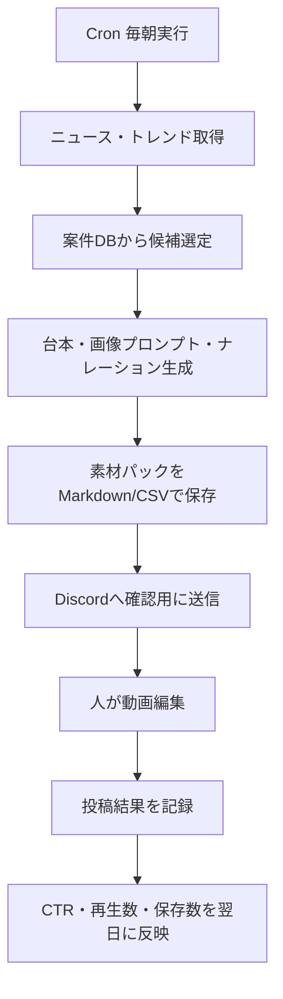

# AIアフィリエイト短尺動画 素材生成ワークフロー

この設計は、動画編集そのものは人が行い、AIは次の素材だけを毎日作る前提です。

- 台本
- ナレーション原稿
- 画像生成プロンプト
- SNSキャプション
- X投稿文
- ハッシュタグ

動画化を後回しにすることで、初期費用とAPIコストを抑えながら、どの訴求が反応されるかを先に検証します。

## 基本コンセプト

アカウントテーマは単一案件ではなく、次の領域に寄せます。

> 通信費・固定費・お金を節約する情報

このテーマなら、auひかりだけでなく、楽天モバイル、ahamo、NURO光、ドコモ光、GMOとくとくBB、証券会社、FX、クレジットカード、電力会社、ガス会社へ横展開できます。

## 初期案件

| 項目 | 内容 |
| --- | --- |
| 案件 | auひかり |
| URL | https://auhikari-net.com |
| ジャンル | 通信・光回線 |
| 主な訴求 | 固定費見直し、自宅ネット、スマホセット割、乗り換え、提供エリア確認 |
| 注意 | 金額、キャンペーン、適用条件は必ず公式LP・ASP管理画面で確認してから使う |

## 1本ごとの出力形式

1投稿につき、AIは次を出します。

1. タイトル
2. 冒頭フック 3案
3. 30秒台本
4. ナレーション原稿
5. 画像生成プロンプト 5〜8枚
6. Instagram / TikTok / YouTube Shorts用キャプション
7. X用投稿文
8. ハッシュタグ
9. CTA
10. 広告表記

## 台本テンプレート

| 秒数 | 役割 | 内容 |
| --- | --- | --- |
| 0〜3秒 | フック | 「まだ毎月のネット代、なんとなく払ってる？」のように自分ごと化 |
| 3〜8秒 | 共感 | 「光回線は月額だけで見ると失敗しやすい」 |
| 8〜20秒 | 判断軸 | エリア、工事費、キャンペーン条件、スマホセット割、解約時費用 |
| 20〜30秒 | CTA | 「条件が合うかはプロフィールのリンクで確認」 |

## ニュース連動の考え方

動画投稿は、商品名だけで押すよりも「今なぜ見るべきか」を先に置きます。

- 通信障害や在宅勤務の話題 → 自宅回線の見直し
- 物価高や固定費削減の話題 → 通信費の見直し
- 新生活、引っ越し、転勤 → 光回線のエリア確認
- W杯、配信、スポーツ観戦 → 家のネット環境
- 災害や停電の話題 → 通信手段の分散、モバイル回線、防災グッズ

ただし、災害・事故・不安を過度に購買誘導へ使わないこと。読者の判断材料として扱います。

## NG表現

- 絶対安くなる
- 誰でも得
- 必ずおすすめ
- 最安
- 公式よりお得
- 今すぐ契約しないと損
- 速度が必ず上がる
- キャッシュバックが必ずもらえる

## 安全な表現

- 条件が合えば候補になります
- 提供エリアと適用条件は先に確認してください
- 月額だけでなく、工事費や解約時費用も見ます
- キャンペーン内容は変わるため、公式ページで最新条件を確認してください
- 向いている人と向いていない人を分けて見ます

## n8n連携の初期フロー

## データベース方針

最初はSQLiteで十分です。将来PostgreSQLへ移行しやすいよう、テーブルを分けます。

| テーブル | 役割 |
| --- | --- |
| video_campaigns | 案件名、URL、ASP、ジャンル、訴求軸、NG表現 |
| video_script_jobs | 生成日、案件、ニュース文脈、投稿先、ステータス |
| video_scripts | フック、台本、ナレーション、CTA |
| video_image_prompts | 画像プロンプト、比率、用途、生成済みファイル |
| video_post_results | 再生数、いいね、保存、クリック、CV |

## 初期運用

- 1日3本分の素材を生成
- そのうち1本を手動で動画化
- Xは動画なしでも同テーマで12投稿
- 1週間後に反応が高いフックだけ残す

最初から動画を大量生成するより、反応する言葉を見つける方が先です。
